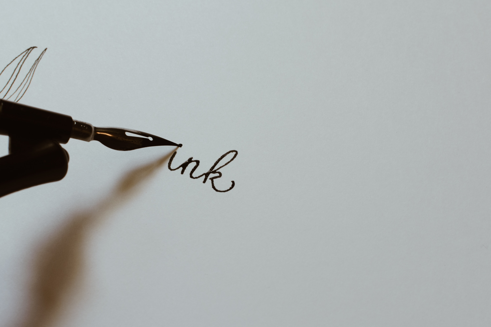

## What Does Your Handwriting Say About You?

I just bought my first Rocketbook notebook (for myself) today 
and this is really exciting. It sent me on a deep dive into what 
my handwriting says about me. So, in case you were asking yourself 
the same question, you may want to [check this out for yourself](https://www.pens.com/handwriting-infographic/?utm_source=contentmarketing&utm_medium=embed&utm_campaign=Handwriting%20Infographic).

> Handwriting analysis (also known as graphology) can even be used for 
> detecting lies and revealing possible health ailments.


###### Photo by Kelly Sikkema on Unsplash

```js
function helloWorld() {
  console.log("Hello World!")
}
```